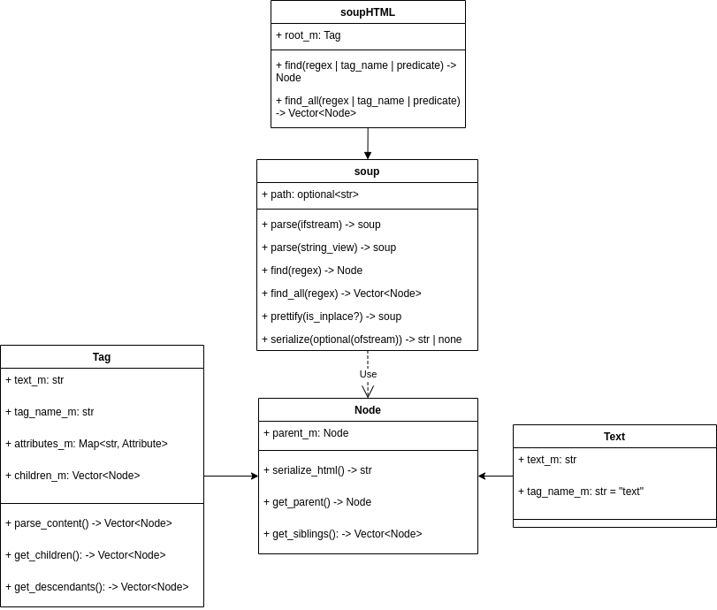

# soupcxx
Course Project for Modern C++ Spring 24'

It is built to implement the basic DOM-tree parsing, navigation and modification. Note that it is in the very early stage of the development and many bugs are to be discovered.

## Structure

There is `Soup` and `Node` abstract classes to make other soups (such as markdown or xml) possible. Overall, the HTML soups use only `Tag` and `Text` nodes.



## Usage

File `demo.cpp` demonstrates basic workflow with the library. It uses `alice_large.html` as a source data.

### Initialization

You can create a soup from an HTML string:

```c++
HTMLSoup soup{content};
```

### Modifying the Tree

To modify anything, you should find the desired element and change in a way you want. Let us change the class name for the first link we find:

```c++
(*dynamic_cast<Tag*>(soup.find("a").get()))["class"] = "test_class";
```

Note that `find()` returns a pointer to an abstract class `Node`, and since `operator[]` is implemented only for `Tag`, you will have to perform a dynamic cast to access the attribute (`Text` nodes cannot have any attributes)

Result:

before:

```html
<a href="http://example.com/elsie" class="sister" id="link1">Elsie</a>
```

after:

```html
<a id="link1" class="test_class" href="http://example.com/elsie" >
        Elsie
</a>
```

### Finding All Links

```c++
for (const auto& tag : soup.find_all("a")) {
        std::cout << std::get<std::string>((*dynamic_cast<Tag*>(tag.get()))["href"]) << std::endl;
    }
```

Result:

```
http://example.com/elsie
http://example.com/lacie
http://example.com/tillie
http://example.com/magical_tree
http://example.com/enchanted_cottage
http://example.com/hidden_cave
```

### Navigating using get_parent(), get_siblings(), get_children()

Please take a look at `demo.cpp` for the detailed examples of how to navigate the Node's relatives.

## Benchmarked against BeautifulSoup4

The library was compared to Python BeautifulSoup4 with different parsers. Soupcxx was much faster than all of them. You can replicate the experiments using the code in `./benchmarks/` directory.

Parse and prettify the soup to string:


Parse and find all links:

